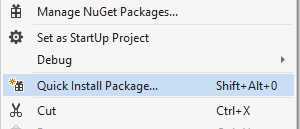
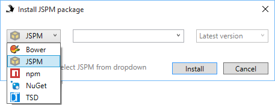
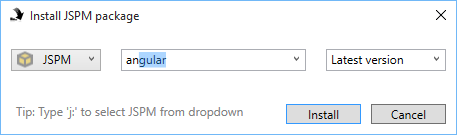
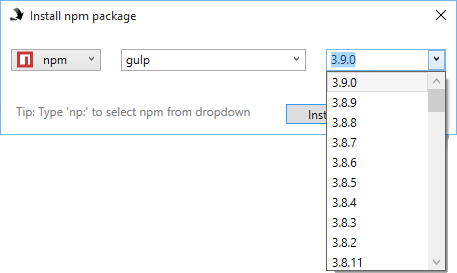
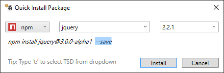
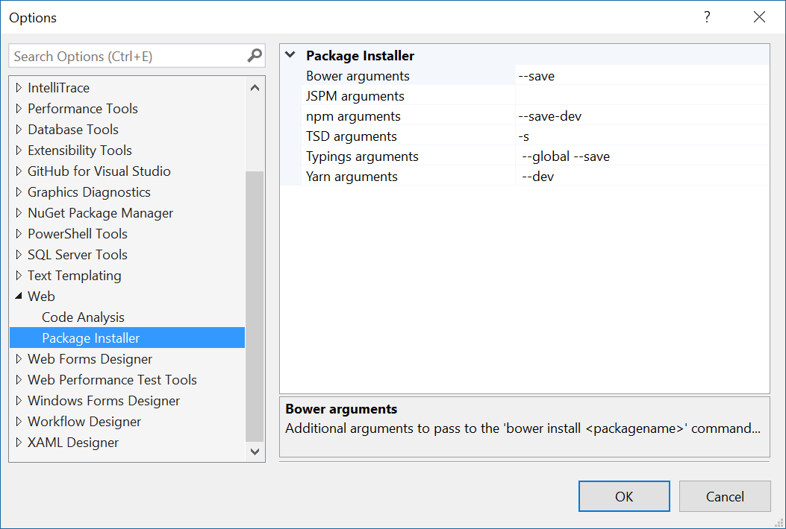

# Package Installer

[](https://ci.appveyor.com/project/madskristensen/packageinstaller)

Download the extension at the
[VS Gallery](https://visualstudiogallery.msdn.microsoft.com/753b9720-1638-4f9a-ad8d-2c45a410fd74)
or get the
[nightly build](http://vsixgallery.com/extension/fdd64809-376e-4542-92ce-808a8df06bcc/)

------------------------------------------------

A Visual Studio extension that makes it easy and fast to install
Bower, npm, JSPM, TSD and NuGet packages.

See the [changelog](CHANGELOG.md) for changes and roadmap.

## Features

- Supports Bower, npm, JSPM, TSD (DefinatelyTyped) and NuGet
- Works for all project types including ASP.NET 5, WebForms, Website projects and more
- Intellisense for package names and versions
- Automatically creates package.json or bower.json if missing
- Automatically creates gulp-/grunt-/brocfile.js if they are being installed using npm
- Selects the last used package manager
- Customize arguments passed to each package manager

### Install a package
Simply right-click the project and select "Quick Install Package..."
to pop open the installer dialog box.



### Choose package manager
Select which package manager to use.



You choice is remembered for next time you open the dialog.

### Auto completion
You get full auto completion for all package names available
in the Bower, npm, JSPM, TSD and NuGet registries.



Also for version numbers for both Bower and npm:



### Custom arguments
You can specify any custom arguments to the package managers
that support it.



The default arguments for each package manager can be set in
the Options dialog. 



### DefinatelyTyped package manager (TSD)
You must install TSD using npm in order for the TSD package manager
to work.

Open a console and type the following command:

```cmd
npm install tsd -g
```

Now TSD is installed globally on the system and this extension
can use it.

### bower.json / package.json
You can install packages without having set up Bower, JSPM or npm.

This extension will automatically create the JSON configuration
files, so you don't have to worry about it.

### Keyboard shortcut
The fastest way to display the dialog is to use the keyboard
shortcut `Shift+Alt+0`.

## Contribute
Check out the [contribution guidelines](.github/CONTRIBUTING.md)
if you want to contribute to this project.

For cloning and building this project yourself, make sure 
to install the
[Extensibility Tools 2015](https://visualstudiogallery.msdn.microsoft.com/ab39a092-1343-46e2-b0f1-6a3f91155aa6)
extension for Visual Studio which enables some features
used by this project.

## License
[Apache 2.0](LICENSE) 